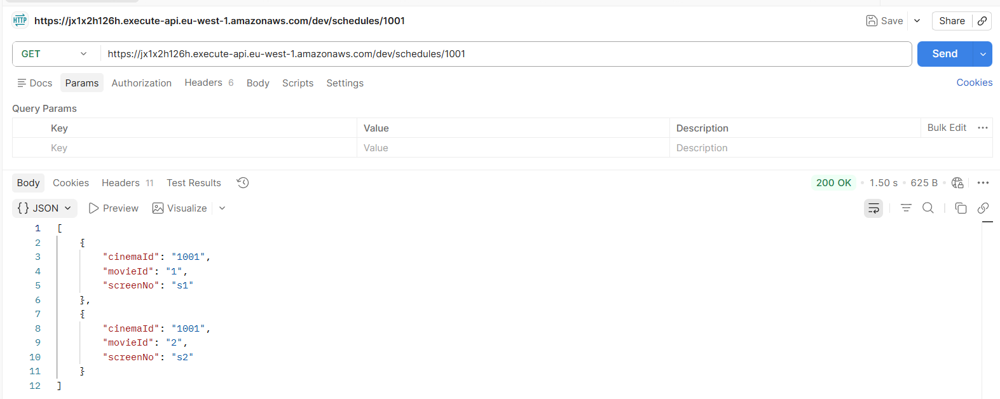
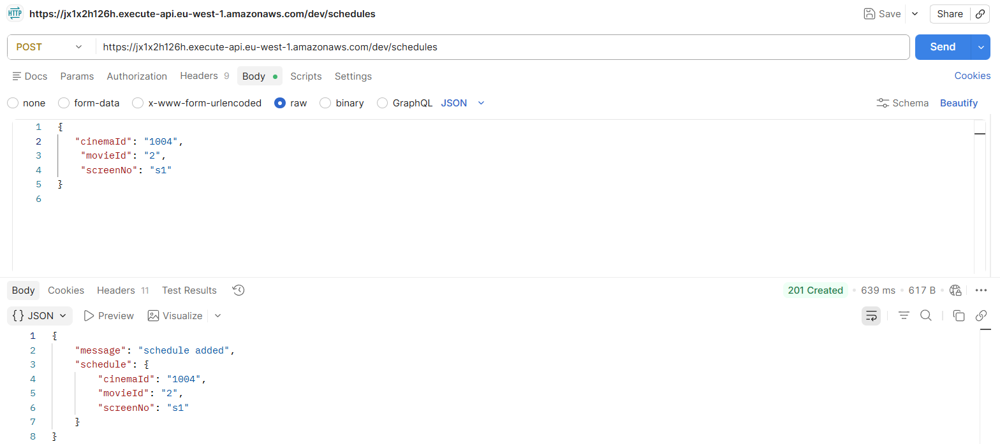
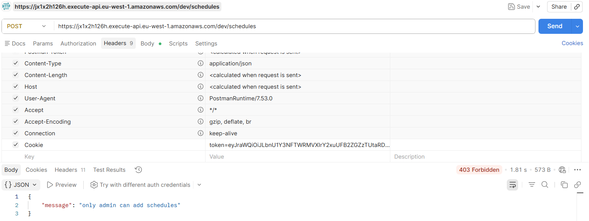
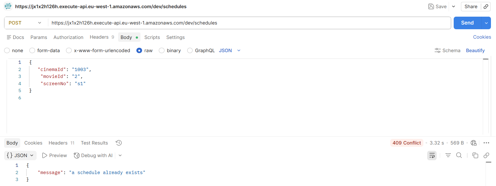

## Enterprise Web Dev - Lab-based Exam.
## Name: Hoang Phuc Le
## Student ID: 20115747
## Serverless web API

### Screenshots
Part A.1 - GET /schedules/{cinemaId}

Part A.2 - GET /schedules/{cinemaId}?[movieId=movieId]
![GET /schedules/{cinemaId}?[movieId=movieId]](./screenshots/partA-2.png)

Part B.1 - POST /schedules with admin username

Part B.2 - POST /schedules with non-admin username

part B.3 - POST /schedules with existing schedule
